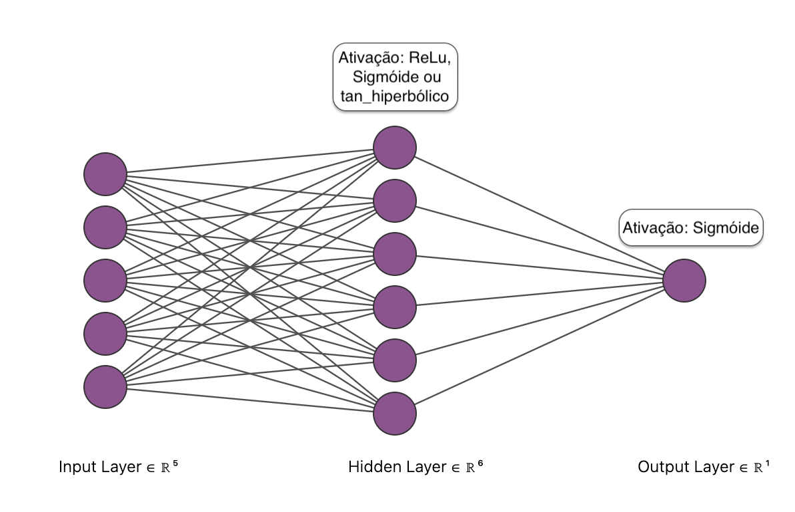

<h3 style=text-align:center>UNIVERSIDADE FEDERAL DO PARÁ </br> Redes Neurais Artificiais</h3>

<h4 style=text-align:center> Tarefa de implementação do algoritmo backpropagation</br>
<b>Etapa 1:</b> Peseudocódigo</h4>

</br>
</br>

<div style=text-align:right>
<b>Professora: </b> ADRIANA ROSA GARCEZ CASTRO </br>
<b>Alunos:</b> </br>
Alana Miranda Medeiros. Email: <i>alanamirandaufpa@gmail.com</i> </br>
Joaquim Armando Dlima Viana. Email: <i>jviana@unilurio.ac.mz</i> </br>
</div>

</br>
</br>
</br>


<div style=text-align:center>Maio de 2024</br>
Link de acesso a este pseudocódigo no <a href='https://github.com/AlanaMiranda/backpropagation'>Github: </a> </div>

</br>
</br>
</br>
</br>

### Objetivo:

* Implementar o algoritmo backpropagation para um problema de classificação

### Linguagem de implementação:

* Python

</br>

### Pseudocódigo
```python
Função BACKPROPAGATION (entrada_X, entrada_Y,
                        neuronios_camada_escondida,
                        funcao_de_ativacao,
                        taxa_de_aprendizagem,
                        epocas)

    # Normalização dos dados de entrada
    entrada_X <- normalizacao(entrada_X)

    # Divisão dos dados em 60-20-20
    dataset <- concatenar(entrada_X, entrada_Y)
    treino, validacao, teste <- dividir(dataset, 60%, 20%, 20%)
    x_treino, y_treino <- separar(treino)
    x_validacao, y_validacao <- separar(validacao)
    x_teste, y_teste <- separar(teste)

    # Inicialização arbitrária dos pesos e biases
    # Pesos e biases da primeira camada
    W1 <- inicializar_pesos(neuronios_entrada, neuronios_camada_escondida) 
    B1 <- inicializar_biases(neuronios_camada_escondida) 

    # Pesos e biases da segunda camada
    W2 <- inicializar_pesos(neuronios_camada_escondida, 1)
    B2 <- inicializar_biases(1)

    erros_validacao <- []

    Para cada época de 1 a epocas:
        Para cada exemplo de treinamento (x, y) em (x_treino, y_treino):

            # Propagação direta
            # Saída e ativação na camada escondida
            S1 <- propagacao_direta(x, W1, B1)
            Z1 <- ativacao(S1, funcao_de_ativacao)

            # Saída e ativação na camada de saída
            S2 <- propagacao_direta(Z1, W2, B2)
            Z2 <- ativacao(S2, funcao_de_ativacao) 

            # Cálculo do erro na saída
            erro_atual <- calcular_erro(y, Z2)

            Se erro_atual > erro_anterior:
                Parar o treinamento

            Senão:
                Atualizar erros_validacao com erro_atual

                # Retropropagação
                derivada_Erro_B2 <- retropropagacao(S2)
                derivada_Erro_W2 <- retropropagacao(W2)

                # Atualizar pesos e biases na segunda camada
                W2 <- W2 - taxa_de_aprendizagem * derivada_Erro_W2
                B2 <- B2 - taxa_de_aprendizagem * derivada_Erro_B2

                derivada_Erro_B1 <- retropropagacao(S1)
                derivada_Erro_W1 <- retropropagacao(W1)

                # Atualizar pesos e biases na primeira camada
                W1 <- W1 - taxa_de_aprendizagem * derivada_Erro_W1
                B1 <- B1 - taxa_de_aprendizagem * derivada_Erro_B1

    Retornar Z2, erros_validacao, pesos

```
</br>
</br>
</br>

### Arquitetura da Rede Neural
</img>